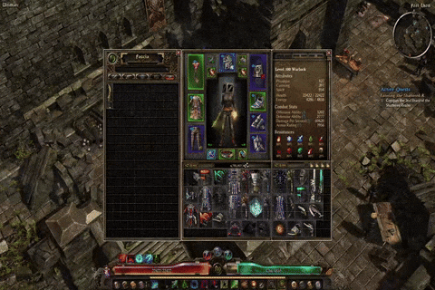

# Introduction

This is a utility tool designed for *Grim Dawn* that automates selling and dismantling items from your inventory. By simulating mouse clicks on predefined UI elements, it allows you to quickly manage your inventory without manual interaction.

> **Note:**  
> The default pixel values in the configuration are designed for a 1920x1080 screen with the default UI scale in Grim Dawn. If your screen resolution or UI scale differs, you may need to adjust the values in the configuration file.



# Installation

Install the latest release, may need to run the .exe as administrator for it to work. Run the .exe and you'll be able to use the shortcuts while Grim Dawn is open.

[Download the latest release](https://github.com/MustafaErvaErgul/GD-Utils/releases)

Check the usages below to see what keybinds do.

# Usage

- Press F2 while an NPC window is open to sell everything on your main & active secondary bag.
- Press F3 while an NPC window is open to sell everything on your active secodnary bag.
- Press F4 while Inventor window is open to dismantle everything on your main & active secondary bag.
- Press F5 while Inventor window is open to dismantle everything on your active secondary bag.
- Press F10 while focused on Grim Dawn to instantly terminate program (Can also be closed via Tray icon).

# Features

- **Automated Selling:** Sell items from both your main and secondary inventory grids with a single key press.
- **Automated Dismantling:** Execute the full sequence of clicks to dismantle items automatically.
- **Configurable Shortcuts & Settings:** All UI coordinates, sleep delays, grid settings, and keyboard shortcuts are read from an external `config.ini` file.
- **Active Window Check:** Macros are only executed when Grim Dawn is the active window.
- **System Tray Icon:** The executable creates a tray icon with an exit option, so you can run it without a console window.

# Configuration

The executable reads values from the "config.ini" file that will be in the same directory as the "gdutils.exe", you can adjust the config file for your own setup. Below is an example of what the config file looks like:

```ini
[General]
DEBUG = False

[Shortcuts]
SELL_ALL = F2
SELL_SECONDARY = F3
DISMANTLE_ALL = F4
DISMANTLE_SECONDARY = F5
GLOBAL_EXIT = F10

[Coordinates]
TRANSMUTE_TAB_LOCATION = 720,270
DISMANTLE_TAB_LOCATION = 624,270
DISMANTLE_ITEM_LOCATION = 630,520
DISMANTLE_BUTTON_LOCATION = 624,840
CONFIRM_DISMANTLE_LOCATION = 880,590

[Inventory_Grid_Main]
start_x = 820
start_y = 640
cols = 12
rows = 8

[Inventory_Grid_Secondary]
start_x = 1210
start_y = 640
cols = 8
rows = 8

[Sleeps]
SLEEP_PANEL_OPEN = 0.010
SLEEP_ACTION = 0.001
```

# Packaging Requirements

- Python 3.x  
- [PyInstaller](https://www.pyinstaller.org/) (for building the executable)  
- [Pillow](https://python-pillow.org/) (`pip install Pillow`)  
- [pystray](https://github.com/moses-palmer/pystray) (`pip install pystray`)

# Building the Executable

Use PyInstaller to compile the program into a standalone .exe. For example:

With console
```
python -m PyInstaller --onefile --uac-admin gdutils.py
```

Without console
```
python -m PyInstaller --onefile --noconsole --uac-admin gdutils.py
```
